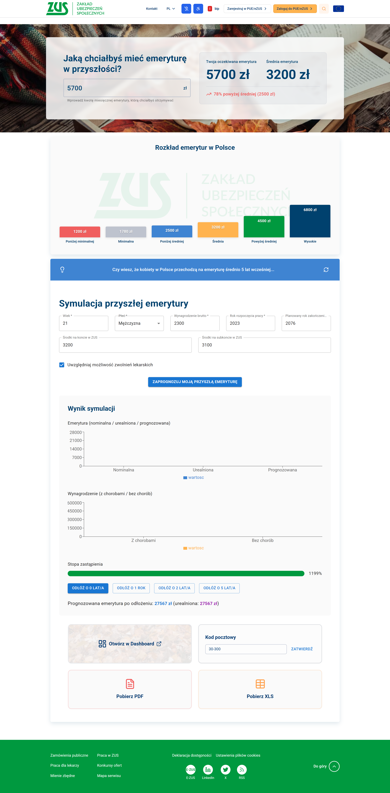

# ZUSim — Symulator Emerytalny  
**HackYeah 2k25 — UnEmploYed**  

> Interaktywny symulator emerytalny (frontend: Vite + React + TypeScript, UI: MUI, backend: .NET/C#).  
> Raporty PDF/XLS, dashboard, symulacja z uwzględnieniem zwolnień lekarskich, eksporty i prosty monitoring użycia.

---

<table>
  <tr>
    <td></td>
    <td></td>
  </tr>
</table>
<p>
  
  
  
  
  

</p>


---

## Spis treści

- [O czym jest projekt](#o-czym-jest-projekt)  
- [Funkcjonalności](#funkcjonalności)   
- [Wymagania](#wymagania)   
- [Szybkie uruchomienie (deweloperskie)](#szybkie-uruchomienie-deweloperskie)  
- [API / Endpoints (przykłady)](#api--endpoints-przykłady)  
- [Eksport PDF / XLS - implementacja](#eksport-pdf--xls---implementacja)
- [Dostępność (WCAG), kolorystyka i style](#dostępność-wcag-kolorystyka-i-style)     
- [Roadmap / dalsze prace](#roadmap--dalsze-prace)    
- [Licencja](#licencja)

---

## O czym jest projekt

ZUSim to aplikacja/symulator umożliwiająca wyliczenie prognozowanej emerytury w oparciu o dane wejściowe (wiek, płeć, wynagrodzenie brutto, rok rozpoczęcia pracy, planowany rok zakończenia pracy, opcjonalne środki na koncie ZUS/subkoncie oraz uwzględnianie zwolnień lekarskich). Wynik podawany jest w postaci emerytury nominalnej i urealnionej, porównania do średniej i wykresów. Możliwość pobrania raportu PDF i XLS oraz zapisania użyć symulatora (raport zainteresowania).

Źródło wymagań: [HackYeah task — ZUS Symulator](https://hackyeah.pl/tasks/DETAILS_ZUS_SymulatorEmerytalny.pdf)

---

## Funkcjonalności

- Pulpit główny (hero) z pytaniem o oczekiwaną emeryturę i szybkim porównaniem do średniej.  
- Symulator emerytury (wymagane: wiek, płeć, wynagrodzenie brutto, rok rozpoczęcia, planowany rok zakończenia; opcjonalne: środki na koncie/subkoncie).  
- Uwzględnianie średniej długości zwolnień lekarskich rozdzielnie dla płci.  
- Indeksacja wynagrodzeń (konfigurowalny wskaźnik; możliwość użycia danych NBP/GUS).  
- Wynik w dwóch formach: `nominal` oraz `real (urealniona)`; dodatkowo wskaźnik zastąpienia, wynagrodzenia z/bez chorób, efekt odłożenia emerytury (1, 2, 5 lat).  
- Dashboard symulatora z możliwością edycji scenariuszy, dodawania okresów chorób.  
- Pobieranie raportu PDF i XLS zawierającego wykresy i tabele.  
- Zbieranie minimalnego raportu użyć (data, godzina, dane wejściowe, wynik, kod pocztowy).  
- Responsywne UI (grid 2x2 tiles, hero z tłem), komponenty shadcn + MUI.  
- Zgodność z WCAG 2.0 (poziom AA).

---


## Wymagania

- Node.js 18+ (rekomendowane 20)  
- pnpm / npm / yarn (rekomendowane `pnpm`)  
- .NET SDK 7.0+ (`dotnet --info`)  
- (opcjonalnie) Excel / LibreOffice  
- Nowoczesna przeglądarka (Chromium, Firefox, Safari)

---

## Szybkie uruchomienie (deweloperskie)

### Frontend

```bash
cd ZUSim
npm install       
npm run dev           # server: (http://127.0.0.1:5000)
```
### Backend

```bash
cd ZUSim-backend
npm install       
docknet run           
```

---


---

## API / Endpoints (przykłady)

### Symulacja emerytury

**Endpoint:** `POST /api/simulation/predict`  
**Opis:** Oblicza prognozowaną emeryturę na podstawie danych wejściowych.

**Request Body:**
```json
{
  "age": 35,
  "gender": "male",
  "salary": 8000,
  "startYear": 2010,
  "endYear": 2045,
  "accountBalance": 0,
  "subAccountBalance": 0,
  "includeSickLeave": true,
  "nominalPension": 2500.12,
  "realPension": 1500.45,
  "replacementRate": 0.3125,
  "salaryWithSickLeave": 500000,
  "salaryWithoutSickLeave": 520000
}
```
---


## Eksport PDF / XLS - implementacja


**Endpoint:** `GET /api/report/download`  
**Query Params:**
- type: `"pdf" | "xls"`
- simulationId: `ID symulacji`

*Response:* `Plik do pobrania z wygenerowanym raportem.`

---

## Dostępność (WCAG), kolorystyka i style

Projekt został stworzony z myślą o dostępności zgodnej z wytycznymi **WCAG 2.0**, aby zapewnić komfort użytkowania dla jak najszerszej grupy odbiorców, w tym osób z niepełnosprawnościami.

### Kluczowe założenia dostępności:
- **Kontrast kolorów**: Wszystkie kolory tekstu i przycisków spełniają wymagany kontrast względem tła, zgodnie z WCAG AA.  
- **Nawigacja klawiaturą**: Wszystkie interaktywne elementy (przyciski, pola formularzy, linki) można obsługiwać przy użyciu klawiatury.  
- **Etykiety i aria-labels**: Pola formularzy i przyciski posiadają odpowiednie etykiety lub atrybuty `aria-label`, ułatwiające korzystanie z czytników ekranu.  
- **Responsywność**: Interfejs jest w pełni responsywny i poprawnie wyświetla się na urządzeniach mobilnych, tabletach i desktopach.  
- **Efekty wizualne**: Animacje i efekty hover są subtelne i nie przeszkadzają w korzystaniu z serwisu.  

### Kolorystyka i style
- Główne kolory projektu nawiązują do identyfikacji wizualnej **ZUS**:  
  - Zielony ZUS: `rgb(0, 153, 63)`  
  - Biały tekst i elementy interaktywne  
- Tło aplikacji jest stonowane, aby nie męczyć wzroku, a wszystkie karty i przyciski wykorzystują lekkie cienie i zaokrąglone rogi dla przyjemniejszego odbioru wizualnego.  
- Dodatkowo wykorzystano efekt **glassmorphism** w niektórych panelach, co poprawia czytelność przy zachowaniu estetyki i nowoczesnego wyglądu.

---

## Roadmap / dalsze prace

Projekt jest w wersji MVP i planujemy dalsze rozwinięcie funkcjonalności oraz usprawnienia UX/UI. Główne kierunki rozwoju to:

### Krótkoterminowe
- Dodanie bardziej zaawansowanej walidacji danych wejściowych w formularzu symulacji.
- Poprawa responsywności i dopasowanie layoutu dla urządzeń mobilnych.
- Optymalizacja wydajności generowania raportów PDF/XLS.

### Średnioterminowe
- Integracja z dodatkowymi API ZUS w celu pobierania aktualnych danych o kontach emerytalnych.
- Wprowadzenie historii symulacji dla zalogowanych użytkowników.
- Ulepszenie efektów wizualnych w dashboardzie (interaktywne wykresy, animacje glassmorphism).

### Długoterminowe
- Implementacja zaawansowanego systemu rekomendacji dla użytkowników na podstawie danych z symulatora.
- Pełna integracja z profilem użytkownika w ZUS w trybie bezpiecznej autoryzacji.
- Wersja mobilna PWA z offline mode i powiadomieniami push.

> Wszystkie prace nad projektem będą dokumentowane w kolejnych commitach, a roadmapa może ulegać zmianie w zależności od feedbacku podczas HackYeah 2k25.

---

## Licencja

Projekt „Symulator Emerytalny ZUS — HackYeah 2k25” jest udostępniony na zasadach licencji MIT.  
Oznacza to, że możesz:

- swobodnie korzystać z kodu w celach prywatnych i komercyjnych,  
- modyfikować, kopiować i rozpowszechniać projekt,  
- korzystać z projektu bez ograniczeń, pod warunkiem zachowania informacji o autorze i dołączonej licencji.

> MIT License © 2025 UnEmploYed HackYeah
